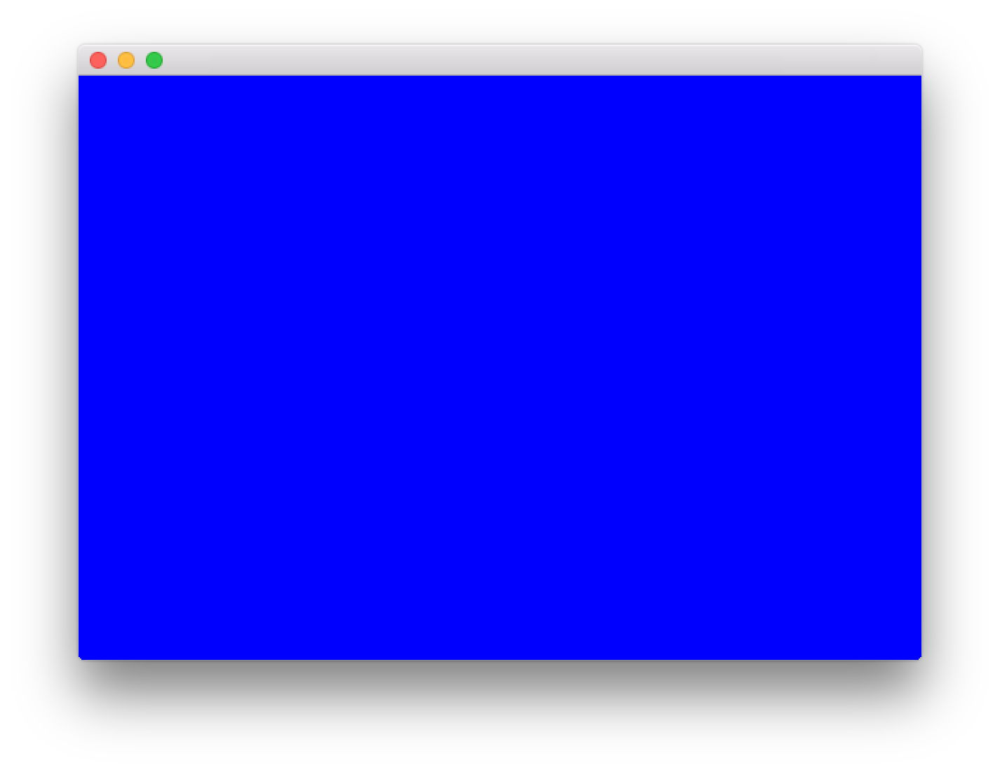
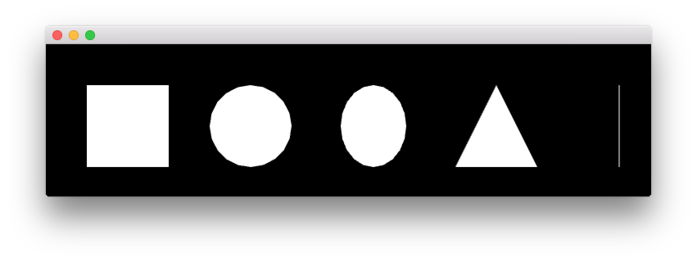
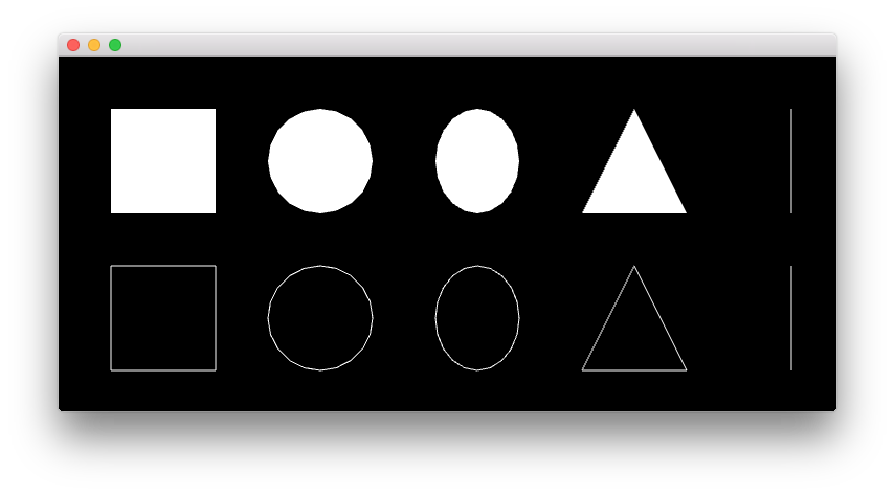

# Basic Shapes

## 뷰 렌더링
WinAPI에서 View 관련 렌더링 영역이 따로 있듯이, OpenFrameworks에는 ofApp 클래스의 View 함수(`void ofApp::draw()`)에서 렌더링 관련된 부분을 처리한다.

## 배경 바꾸기
ofBackground 함수를 통해 아래와 같이 배경을 검은색으로 바꿀수 있다.

```cpp
void ofApp::draw(){
    ofBackground(0);
}
```

원하는 색상이 있다면 `ofBackground(int red, int green, int blue)` 오버로딩 형태를 통해 색을 맞출수 있다.

```cpp
void ofApp::draw(){
    ofBackground(0, 0, 255);
}
```

위 형태는 각각의 색상 정보가 int타입이며, 0 ~ 255의 값을 통해 색상 컬러를 입력하면 된다.



## 도형 그리기

도형을 그리는 함수들은 아래와 같이 다양하게 존재한다.

```cpp
void ofApp::draw(){
    ofBackground(0);  // 배경을 검정색으로
    ofSetColor(255);  // 이 밑으로 그려질 애들은 흰색으로 설정

    // 다양한 도형 그리기
    ofDrawRectangle(50, 50, 100, 100); // (50, 50) 좌표에서 100x100 사각형 렌더링
    ofDrawCircle(250, 100, 50); // (250, 100) 좌표에서 반지름이 50인 원형 렌더링
    ofDrawEllipse(400, 100, 80, 100); // (400 100) 좌표에서 80x100인 타원 렌더링
    ofDrawTriangle(500, 150, 550, 50, 600, 150); // (500, 150), (550, 50), (600, 150) 3개의 정점을 기준으로 삼각형 렌더링
    ofDrawLine(700, 50, 700, 150); // (700, 50)부터 (700, 150)까지 직선 렌더링
}
```



또한 `ofFill` 함수는 앞으로 그려질 애들을 꽉 채워서 렌더링 하게 하며, `ofNoFill`은 그 반대로 속이 비어있는 애들로 렌더링 하게 한다.

```cpp
ofFill();
ofDrawRectangle(50, 50, 100, 100);
ofDrawCircle(250, 100, 50);
ofDrawEllipse(400, 100, 80, 100);
ofDrawTriangle(500, 150, 550, 50, 600, 150);
ofDrawLine(700, 50, 700, 150);

ofNoFill();
ofDrawRectangle(50, 200, 100, 100);
ofDrawCircle(250, 250, 50);
ofDrawEllipse(400, 250, 80, 100);
ofDrawTriangle(500, 300, 550, 200, 600, 300);
ofDrawLine(700, 200, 700, 300);
```



## Refs
* [ofBook - Graphics](http://openframeworks.cc/ofBook/chapters/intro_to_graphics.html)
