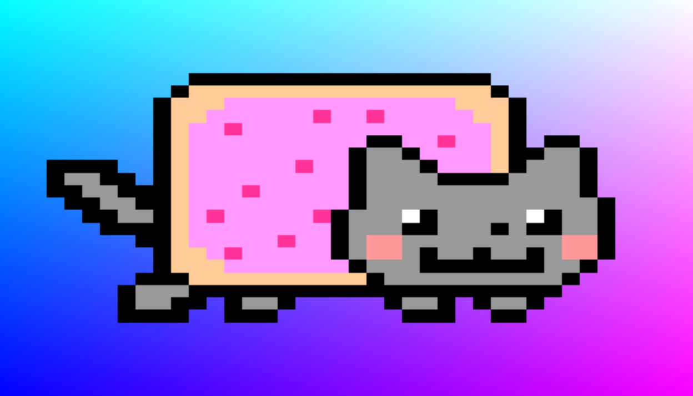

# Shadertoy Nyan Animate


## Shader Code

```Shader
void mainImage( out vec4 fragColor, in vec2 fragCoord )
{
    vec2 uv = fragCoord.xy / iResolution.xy;
    float frame = floor(mod(iGlobalTime*2.0, 1.0)*6.0);
    vec2 tuv = uv/vec2(6.4, 1) + vec2(frame/6.4, 0);
    vec4 t = texture2D(iChannel0, tuv);
    fragColor = vec4(mix(vec3(uv, abs(cos(iGlobalTime))), t.rgb, t.a), 1);
}
```

## Frame?
냥캣 이미지의 경우 6개의 이미지가 합쳐진 스프라이트다.
그래서 시간에 따라 프레임 값을 계산해서 화면에 하나씩 보여주면 된다.

`mod(iGlobalTime*2.0, 1.0)`을 하면 iGlobalTime을 0~1의 값으로 변환할 수 있다.
(mod의 계산식은 [쉐이더 내장 함수](shader-built-in-functions.md)에서 참고, `iGlobalTime*2.0`은 2배 빠르게 재생하기 위함)
스프라이트 내에서 이미지는 총 6장이기 때문에 변환된 0~1의 값에다가 6.0을 곱한 다음, floor를 통해 소수점을 버려주면 딱딱 떨어지는 값이 나오게 된다.
참고로 프레임 계산에서 if-else를 쓰지 않고 굳이 저렇게 계산한 이유는 쉐이더에선 if문을 쓰는게 더 효율이 떨어진다고 한다.

프레임 값을 알게 되면 uv에서 프레임 값만큼 +를 해주면 된다.
+된 uv를 texture2D로 값을 뽑아낸 다음, 화면에 출력하면 끝.
