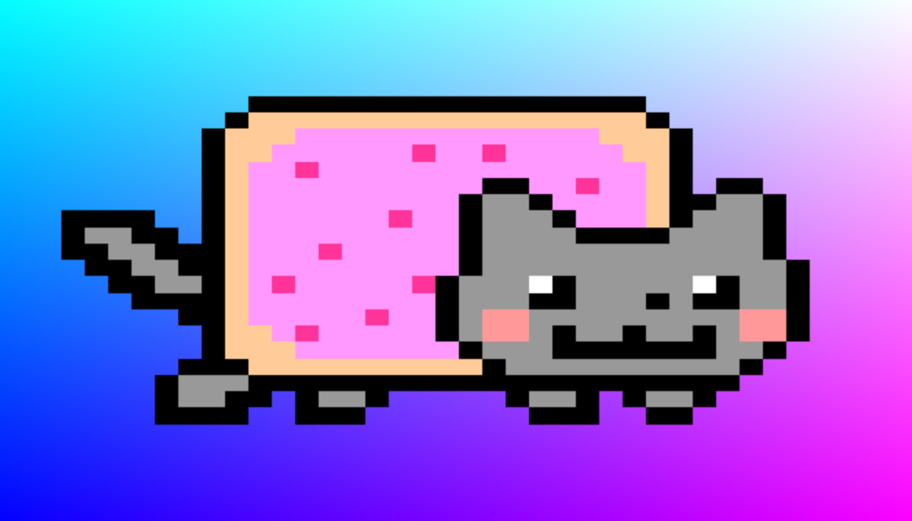

# Shadertoy Nyan Static


## Shader Code

```Shader
void mainImage( out vec4 fragColor, in vec2 fragCoord )
{
    vec2 uv = fragCoord.xy / iResolution.xy;
    vec4 t = texture2D(iChannel0, uv/vec2(6.4, 1));
    fragColor = vec4(mix(vec3(uv, abs(cos(iGlobalTime))), t.rgb, t.a), 1);
}
```

## Why uv/vec2(6.4, 1) ?
nyan cat 이미지가 6장의 스프라이트로 되어 있기 때문에 스크린uv를 스프라이트에 그대로 적용하면 6마리의 고양이가 찌부되어서 보여진다.
그러므로 1마리의 고양이만 표시해주기 위해 uv값에 6.4를 나누었다.

왜 6이 아닌 6.4냐면 6.4가 원본으로 나왔기 때문임. (그러므로 왜 6.4인지는 나도 정확히 모르겠음)
